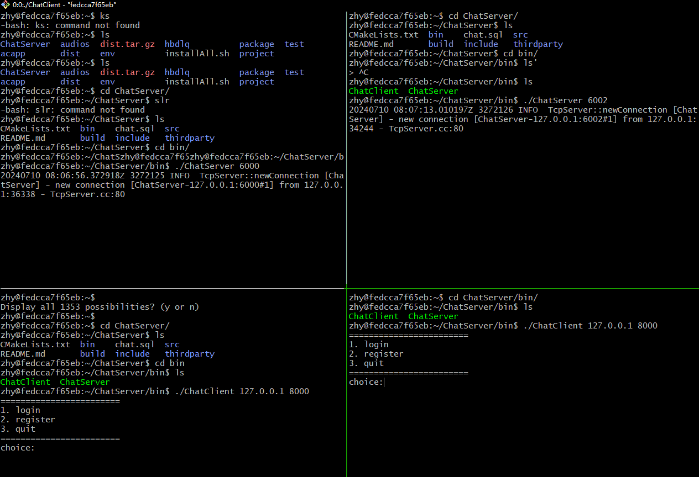
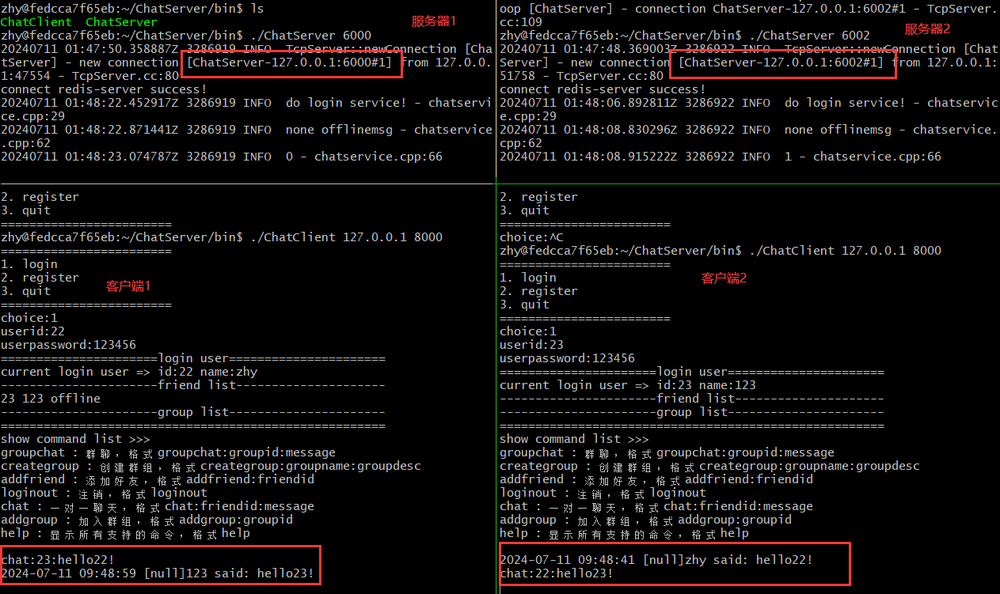

## ChatServer
在Ubuntu20环境下基于muduo开发的集群聊天服务器。目前实现用户注册和登录接口。

## 运行环境
1. 下载[muduo](https://github.com/chenshuo/muduo), [具体安装步骤](https://blog.csdn.net/QIANGWEIYUAN/article/details/89023980)
2. 安装`MySQL`, [安装步骤](https://blog.csdn.net/m0_53721382/article/details/128943162)
3. 下载[nginx](...), 安装步骤如下：
   ```bash
   # 解压
   tar -axvf nginx-1.12.2.tar.gz
   # 配置激活tcp负载均衡模块
   sudo ./configure --with-stream
   # 我运行上面语句缺少pcre库，因此先安装pcre库，重新配置
   sudo apt-get install libpcre3-dev
   sudo ./configure --with-stream
   # 编译 在编译出现报错问题可以参考博客: https://blog.csdn.net/weixin_45525272/article/details/107794364
   sudo make && sudo make install
   # 编译完成后，默认安装在/usr/local/nginx目录，可执行文件在sbin目录里，配置文件在conf目录里
   ```
4. 安装`Redis`和[hiredis c++库](https://github.com/redis/hiredis)
## 项目构建
```bash
git clone https://github.com/djdodsjsjx/ChatServer.git
cd ChatServer
mkdir build
cd build
cmake ..
make
```

## 项目运行
```bash
# 启动服务器
cd ../bin
./ChatServer 6000

# 启动客户端
./ChatClient 127.0.0.1 6000

# 注册测试 {"msgId":1000,"name":"123","password":"123456"}
# 登录测试 {"msgId":1002,"id":22,"password":"123456"}
# 1v1对话测试 {"msgId":1004,"fromid":22,"toid":23,"msg":"hello"}
# 好友添加测试 {"msgId":1005,"id":22,"friendId":23,"msg":"add friend"}
# 创建群组测试 {"msgId":1006,"id":22,"groupname":"zhys","groupdesc":"zhy group"}
# 加入群组测试 {"msgId":1007,"id":23,"groupid":3}
# 群组聊天测试 {"msgId":1008,"id":23,"groupid":3,"msg":"hello group"}
```

## 实现原理
### muduo网络库
muduo 是一个基于 C++ 的高性能网络库，主要用于构建网络服务器和客户端应用。它的设计理念是高效、简洁和易于使用。muduo 的核心线程模型是「one loop per thread + thread pool」，这种模型在处理网络事件时非常高效。

#### muduo 的基本线程模型
1. **One Loop per Thread**:
   - 每个线程都有一个独立的 `EventLoop`，负责处理该线程上的所有 I/O 事件和定时器事件。
   - `EventLoop` 使用 Reactor 模式，通过事件驱动的方式来处理事件，如读写事件、连接事件等。
2. **Thread Pool**:
   - 除了每个线程的 `EventLoop` 外，muduo 还使用一个线程池来处理计算密集型任务或需要异步执行的任务。
   - 线程池中的线程可以并行执行任务，提高整体的处理能力。

#### muduo 的主从 Reactor 模型
muduo 采用主从 Reactor 模型来进一步提高性能：
1. **mainReactor**:
   - `mainReactor` 负责监听新连接的到来。
   - 它使用 `Acceptor` 来接收新的连接请求，并将这些新连接分发到 `subReactor` 上。
2. **subReactor**:
   - `subReactor` 负责维护已建立的连接。
   - 每个 `subReactor` 通常运行在一个独立的线程上，处理连接的读写事件和其他相关事件。

#### 网络模块与业务模块解耦
使用哈希表对得到msgId调用不同的处理函数，实现网络模块和业务模块的解耦。
```cpp
void ChatServer::onMessage(const TcpConnectionPtr& conn, 
                            Buffer* buffer,
                            Timestamp time) {
    // 将json数据转换为string
    string buf = buffer->retrieveAllAsString();
    // 数据的反序列化
    json js = json::parse(buf);
    auto msgHandler = ChatService::instance()->getHandler(js["msgId"].get<int>());

    // 执行对应的业务处理
    msgHandler(conn, js, time);
}
```
## 业务模块
### 注册模块
从网络模块接受数据，根据msgId定位到注册模块。根据客户端传输过来的json对象，获取用户名字和密码生成User对象，在model层中插入到数据库中。
### 登录模块
从网络模块接受数据，更具msgId定位到登录模块。根据客户端传输过来的json对象，获取用户ID和密码，如果用户没有登录则登录该用户，并保存对应通信连接用于后续服务器接受到其他客户端消息后进行转发。
### 服务器异常退出模块
如果服务器异常退出，将所有的在线客户端状态设置为offline
### 客户端异常退出模块
如果客户端异常退出，将该退出的用户状态设置为offline，并删除对应的通信连接。

### 1对1聊天模块
客户端给对应的用户Id发送消息，如果该用户处于登录状态直接转发，否则存储在离线消息中，直到该用户再次登录时，从离线消息中获取并清除对应的离线消息。

### 好友添加模块
用户可以根据指定id号添加好友，并插入到数据库中，当该用户再次登录时可以显示好友列表，后续进行聊天。

### 创建群组模块
用户可以通过群名和群组描述来创建群组。创建群组的用户被设置为管理员，用两个数据库进行存储，1个数据库为群组列表展示各个群组的信息，1个数据库为用户id和群组id的关联信息以及该用户在群组中的身份。

### 加入群组模块
用户可以用过指定群组Id加入该群组，将该成员设置为群成员。

### 群组聊天模块
发送消息的用户想指定群组Id放松msg，这个消息会转发给其他群用户成员，若成员不在线加载至离线表格中。


## Nginx 配置Tcp负载均衡
负载均衡主要用户较大的并发量需求，若使用单个服务器很难实现较高的并发量，因此可以通过增加服务器的数量，分担不同服务器上的压力，本项目选用`Nginx`实现负载均衡功能。`Nginx`有如下三个特点
1. 把客户端的请求按照负载算法分发到具体的业务服务器上。
2. 能够与各个服务器保持心跳机制，检测服务器的故障。
3. 可平滑扩展服务器数量。
安装成功后`Nginx`后，编辑`/usr/local/nginx/conf/nginx.conf`
```bash
stream {
   upstream MyServer {  # 监听的两个服务器   weight依次轮询的权重
      server 127.0.0.1:6000 weight=1 max_fails=3 fail_timeout=30s;
      server 127.0.0.1:6002 weight=1 max_fails=3 fail_timeout=40s;
   }

   server {
      proxy_connect_timeout 1s;
      listen 8000;  # 监听端口
      proxy pass Myserver;
      tcp_nodely on;
   }
}
```
完成配置后启动`/usr/local/nginx/sbin/nginx`或者平滑重启`/usr/local/nginx/sbin/nginx -s reload`。
负载均衡测试，启动两个服务器，分别用两个客户端连接，可以轮询分配到不用的服务器中。


## 服务器中间件——使用redis发布-订阅解决跨服务器通信问题
先前在单一的服务器中维护了一个连接的用户表，但是引入负载均衡模块，登录用户被分配至不同的服务器中，若各个服务器间相互通信，耦合度太高占用大量的socket资源，因此需要在多个服务器中维护一个中间件redis消息队列在能够实现跨服务器的通信问题的同时，解耦各个服务器，而不是各个服务器间相互通信，节省服务器管带资源。

安装完`redis`后器，启动redis服务`redis-server`
1. `subscribe channel`订阅指定通道
2. `publish channel message`发布消息到指定通道
功能测试，首先启动两个服务器1和2，再启动两个客户端分别轮询到各自服务器，两个服务器之间通过Redis消息队列进行消息的转发。
